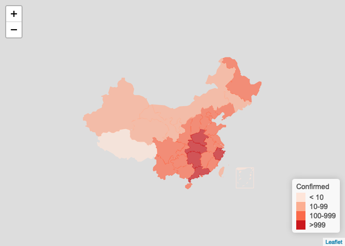
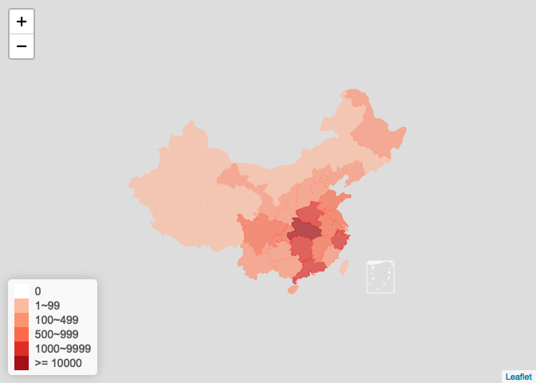
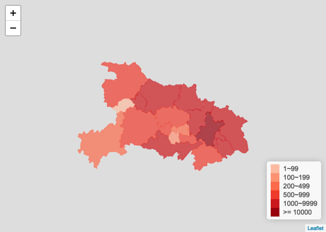
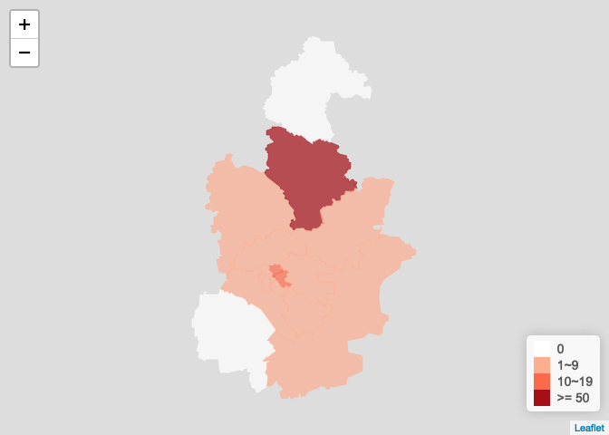
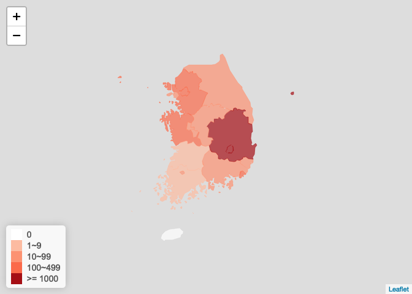
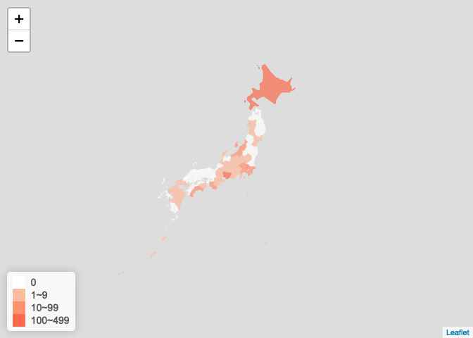
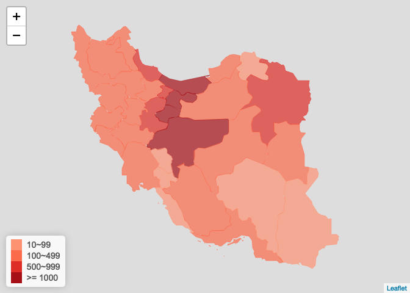
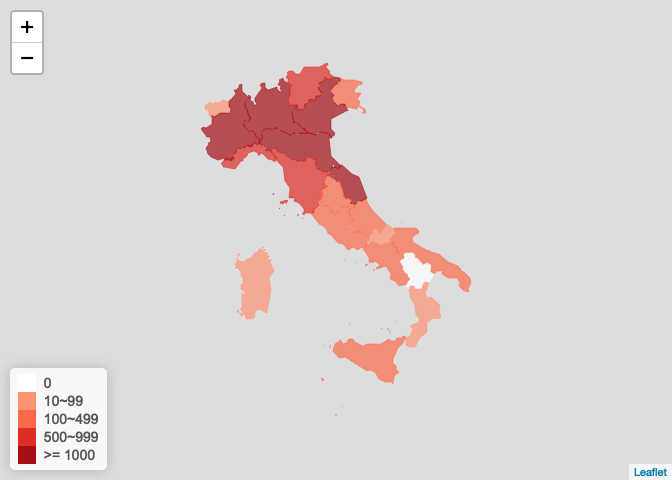

ncovr: Read and process nCoV data 新型冠状病毒数据获取和可视化
================
2020-03-16

这是一个 R 语言包，使用教程详见 <https://openr.pzhao.org/zh/tags/ncovr/>。这里是个简介。

ncovr 包是方便 R 用户获取新型冠状病毒（2019-nCoV）数据而开发的，后续增添了数据处理、建模、可视化等功能。

## 数据获取途径

ncovr 包获取数据的主要途径是
[BlankerL/DXY-2019-nCoV-Crawler](https://github.com/BlankerL/DXY-2019-nCoV-Crawler)。这个项目提供了
api 接口和 csv 文件。为了减轻 api 的流量压力， ncovr 每天将每天自动从这个 api 读一次数据，保存成 R 语言直接读取的
.RDS 格式，方便 R 语言用户调用。详见下面的示例。

## 安装

1.  安装 R。在 [CRAN](http://cran.r-project.org) 上选择适合你操作系统的安装包来安装。

2.  安装 remotes 包：`install.packages('remotes')`

3.  安装 ncovr 包：`remotes::install_github('pzhaonet/ncovr')`

## 获取数据

``` r
# Sys.setlocale('LC_CTYPE', 'Chinese') # windows 用户设置中文环境
require("ncovr")
```

    ## Loading required package: ncovr

``` r
require("leafletCN")
```

    ## Loading required package: leafletCN

``` r
ncov <- get_ncov() # 读取 RDS数据（推荐）国内从github读取数据不稳定!

# get_ncov(method = 'csv') # 从 csv 文件读取（推荐）
# get_ncov(method = 'api') # 从 api 接口读取
```

另外提供了下载数据的函数`get_ncov2()`，定义新的 ncov 类(实际也是data frame)，提供了`subset()`方法,
用于提取 ncov 子集，参数可以是省份、china或者world

``` r
ncov2 <- get_ncov2()
ncov2
```

    ## All COVID 2019 Data
    ## Updated at 2020-03-16 15:44:16 
    ## From https://github.com/yiluheihei/nCoV-2019-Data

``` r
# 湖北 ncov, 按市统计
hubei_ncov <- ncov2["湖北"]
hubei_ncov
```

    ## Hubei COVID 2019 Data
    ## Updated at 2020-03-16 13:54:01 
    ## From https://github.com/yiluheihei/nCoV-2019-Data

``` r
head(data.frame(hubei_ncov), 5)
```

    ##   cityEnglishName cityName provinceName provinceShortName provinceEnglishName
    ## 1           Wuhan     武汉       湖北省              湖北               Hubei
    ## 2         Xiaogan     孝感       湖北省              湖北               Hubei
    ## 3           Ezhou     鄂州       湖北省              湖北               Hubei
    ## 4         Suizhou     随州       湖北省              湖北               Hubei
    ## 5        Jingzhou     荆州       湖北省              湖北               Hubei
    ##   currentConfirmedCount confirmedCount suspectedCount curedCount deadCount
    ## 1                  9102          50003              0      38432      2469
    ## 2                   125           3518              0       3266       127
    ## 3                    62           1394              0       1275        57
    ## 4                    41           1307              0       1221        45
    ## 5                    38           1580              0       1492        50
    ##            updateTime
    ## 1 2020-03-16 13:54:01
    ## 2 2020-03-16 13:54:01
    ## 3 2020-03-16 13:54:01
    ## 4 2020-03-16 13:54:01
    ## 5 2020-03-16 13:54:01

``` r
# china，按省统计
china_ncov <- ncov2["china"]
head(data.frame(china_ncov), 5)
```

    ##     provinceName provinceShortName provinceEnglishName currentConfirmedCount
    ## 1           中国              中国               China                  9951
    ## 2         湖北省              湖北               Hubei                  9557
    ## 3         辽宁省              辽宁            Liaoning                     9
    ## 4 广西壮族自治区              广西             Guangxi                     2
    ## 5         海南省              海南              Hainan                     1
    ##   confirmedCount suspectedCount curedCount deadCount          updateTime
    ## 1          81099              0      67930      3218 2020-03-16 13:54:38
    ## 2          67798              0      55142      3099 2020-03-16 13:54:01
    ## 3            125              0        115         1 2020-03-16 13:54:01
    ## 4            252              0        248         2 2020-03-16 13:49:01
    ## 5            168              0        161         6 2020-03-16 13:49:01

``` r
# world， 按国家统计
world_ncov <- ncov2["world"]
```

    ## Parsed with column specification:
    ## cols(
    ##   countryName = col_character(),
    ##   countryEnglishName = col_character()
    ## )

``` r
head(data.frame(world_ncov), 5)
```

    ##    countryEnglishName    countryName currentConfirmedCount confirmedCount
    ## 1         Afghanistan         阿富汗                    16             16
    ## 2             Albania     阿尔巴尼亚                    41             42
    ## 3             Algeria     阿尔及利亚                    41             54
    ## 4             Andorra         安道尔                     1              2
    ## 5 Antigua and Barbuda 安提瓜和巴布达                     1              1
    ##   suspectedCount curedCount deadCount          updateTime
    ## 1              0          0         0 2020-03-16 06:53:45
    ## 2              0          0         1 2020-03-16 06:53:45
    ## 3              0         10         3 2020-03-16 06:53:45
    ## 4              0          1         0 2020-03-16 06:53:45
    ## 5              0          0         0 2020-03-16 06:53:45

## 国家地图

按省级显示

``` r
plot_map(ncov$area)
```

<!-- -->

``` r
# log scale
plot_map(ncov$area, scale = "log")
```

<!-- -->

更进一步使用`plot_china_map()`可通过设置`bins`参数控制如何分组以填充不同的颜色，
自动把ncov为0的地区（包括南海驻岛）填充为白色

``` r
plot_china_map(
  china_ncov, 
  bins = c(1, 100, 500, 1000, 10000), 
  legend_position = "bottomleft"
)
```

<!-- -->

按城市显示

``` r
plot_map(ncov$area, method = "city", scale = "log")
```

<!-- -->

ggplot

``` r
library(ggplot2)
ncov$area$date <- as.Date(ncovr:::conv_time(ncov$area$updateTime))
choose_date <- "2020-02-10"
x <- ncov$area[ncov$area$date <= as.Date(choose_date), ]
x <- x[!duplicated(x$provinceName), ]
plot_ggmap(x)
```

    ## Parsed with column specification:
    ## cols(
    ##   province = col_character(),
    ##   city = col_character(),
    ##   long = col_double(),
    ##   lat = col_double()
    ## )

<!-- -->

## 省疫情图

湖北省疫情图

``` r
# plot_province_map(ncov2, "湖北省")，或
plot_province_map(hubei_ncov, "湖北省", bins = c(1, 100, 200, 500, 1000, 10000))
```

<!-- -->

或直接基于ncov作图，无需提前取各省ncov数据，天津疫情图

``` r
plot_province_map(ncov2, "天津市", bins = c(1, 10, 20, 50))
```

<!-- -->

## 世界地图:各国疫情图

``` r
ncov$area$date <- as.Date(ncovr:::conv_time(ncov$area$updateTime))
ncov$area <- ncov$area[rev(order(ncov$area$date)), ]

ncov_date <- as.character(Sys.Date())
y <- ncov$area[ncov$area$date <= as.Date(ncov_date), ]
y <- y[!duplicated(y$provinceName), ]

countryname <- data.frame(
  ncovr = c("United Kiongdom", "United States of America", 
            "New Zealand", "Kampuchea (Cambodia )"
          ),
  leafletNC = c("UnitedKingdom", "UnitedStates", 
                "NewZealand", "Cambodia"
  ), 
  stringsAsFactors = FALSE
)

x <- data.frame(
  countryEnglishName = y$countryEnglishName,
  countryName = y$countryName, 
  confirmedCount = y$confirmedCount, 
  stringsAsFactors = FALSE
)


loc <- which(x$countryEnglishName %in% countryname$ncovr)
x$countryEnglishName[loc] <- countryname$leafletNC[
  match(x$countryEnglishName[loc], countryname$ncovr)
]

x$countryEnglishName2 = x$countryEnglishName # for taiwan

x_other <- x[!is.na(x$countryEnglishName) & x$countryEnglishName != 'China', ]
x_china <- data.frame(
  countryEnglishName = 'China',
  countryName = unique(x[!is.na(x$countryEnglishName) & x$countryEnglishName == 'China', 'countryName']),
  confirmedCount = sum(x[!is.na(x$countryEnglishName) & x$countryEnglishName == 'China', 'confirmedCount']),
  countryEnglishName2 = 'China'
) 
x_taiwan <- x_china
x_taiwan$countryEnglishName2 = "Taiwan"
x <- rbind(x_other, x_china, x_taiwan)


plot_map(
  x = x, 
  key = "confirmedCount", 
  scale = "log", 
  method = 'country', 
  legend_title = paste0("Cnfrm 确诊"), 
  filter = '待明确地区'
)
```

    ## New names:
    ## * `` -> ...76

<!-- -->

## ts

``` r
x_ts <- ncov$area[, c('countryEnglishName', 'countryName', 'date', 'confirmedCount', 'curedCount', 'deadCount')] %>% 
  dplyr::group_by(countryEnglishName, date) %>% 
  dplyr::summarise(
    confirmed = max(confirmedCount), 
    cured = max(curedCount), 
    dead = max(deadCount)) %>% 
  dplyr::ungroup() %>% 
  dplyr::filter(!is.na(countryEnglishName) & !countryEnglishName == 'China') %>% 
  as.data.frame()
loc <- which(x_ts$countryEnglishName %in% countryname$ncovr)
x_ts$countryEnglishName[loc] <-
  countryname$leafletNC[
    match(x_ts$countryEnglishName[loc], countryname$ncovr)
  ]

plot_ts(
  x_ts, 
  area = "Italy", 
  area_col = "countryEnglishName", 
  date_col = "date", 
  ts_col = c("confirmed", "cured", "dead")
) 
```

<!-- -->

## 国外疫情图

### 韩国疫情图

``` r
korea_ncov <- get_foreign_ncov("韩国")
plot_foreign_map(korea_ncov, "korea")
```

    ## Parsed with column specification:
    ## cols(
    ##   name = col_character(),
    ##   name_zh = col_character(),
    ##   provinceName = col_character(),
    ##   provinceEnglishName = col_character()
    ## )

<!-- -->

### 日本疫情图

``` r
jp_ncov <- get_foreign_ncov("日本")
plot_foreign_map(jp_ncov, "japan")
```

    ## Parsed with column specification:
    ## cols(
    ##   name = col_character(),
    ##   name_zh = col_character(),
    ##   provinceName = col_character(),
    ##   provinceEnglishName = col_character()
    ## )

<!-- -->

### 伊朗疫情图

``` r
iran_ncov <- get_foreign_ncov("伊朗")
plot_foreign_map(iran_ncov, "iran")
```

    ## Parsed with column specification:
    ## cols(
    ##   name = col_character(),
    ##   name_zh = col_character(),
    ##   provinceName = col_character(),
    ##   provinceEnglishName = col_character()
    ## )

<!-- -->

### 意大利疫情图

``` r
italy_ncov <- get_foreign_ncov("意大利")
plot_foreign_map(italy_ncov, "italy")
```

    ## Parsed with column specification:
    ## cols(
    ##   name = col_character(),
    ##   name_zh = col_character(),
    ##   provinceName = col_character(),
    ##   provinceEnglishName = col_character()
    ## )

<!-- -->

### 直接画这四个国家的疫情图

``` r
foreign_countries <- c("韩国", "伊朗", "日本", "意大利")
names(foreign_countries) <- c("korea", "iran", "japan", "italy")
htmltools::tagList(purrr::imap(
  foreign_countries, 
  ~ get_foreign_ncov(.x) %>% 
    plot_foreign_map(.y)
))
```

更多功能请参看函数的帮助信息

# License

Copyright [Peng Zhao](http://pzhao.org).

Released under the GPL-3 license.
